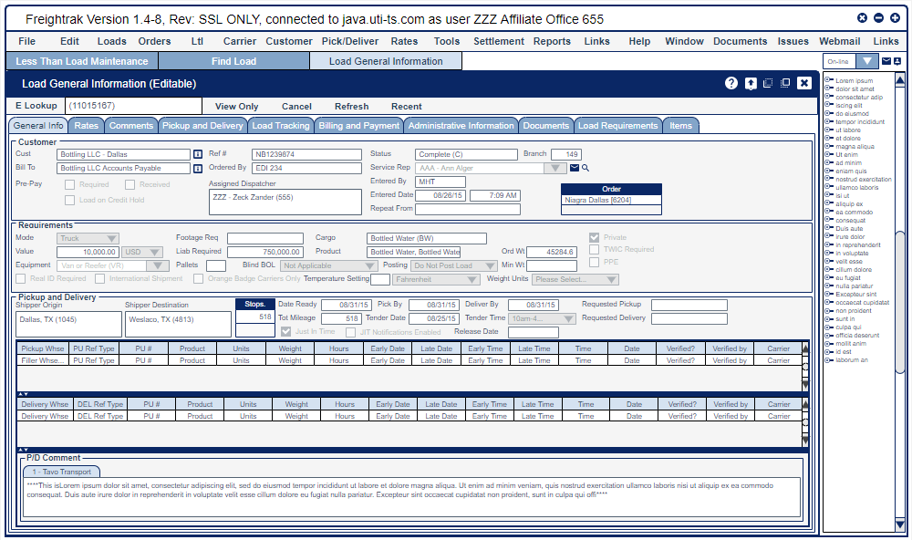
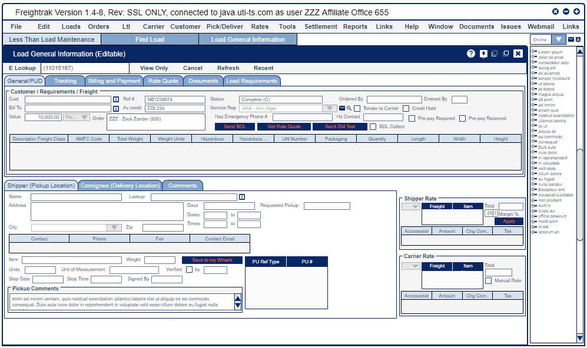
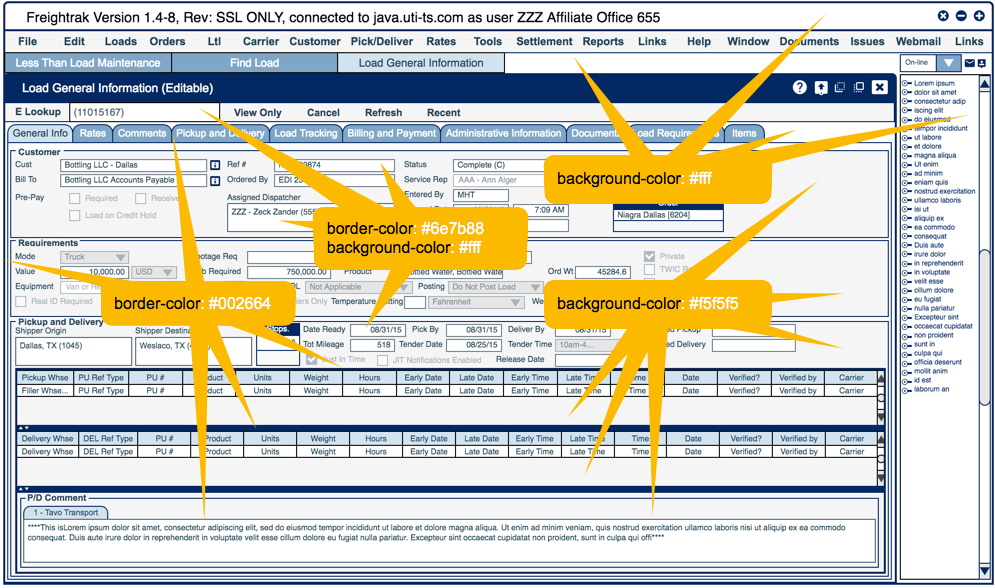
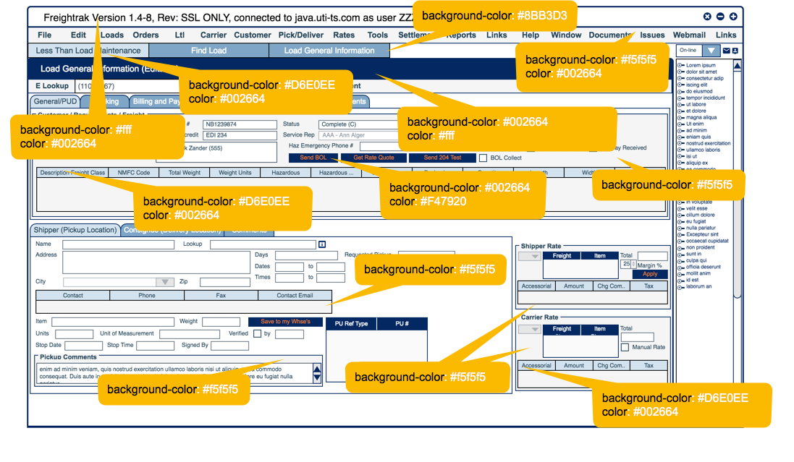

## Syntetica Look and Feel for DSV Road project

### Introduction
New Synth Look and Feel for DSV Road Project according mock-ups:
1) Mock up #1

2) Mock up #2


### Color pallete

Uses mostly blue shades:




### Installation
To connect new skin to the current project:
1. Put the snippet into your code:
``` java
    // Set custom defined look and feel through external XML
    SynthLookAndFeel synth = new SynthLookAndFeel();
    try {
      synth.load(SwingDemo.class.getResourceAsStream("synth.xml"), SwingDemo.class);
    } catch (ParseException e) {
      e.printStackTrace();
    }
    try {
      UIManager.setLookAndFeel(synth);
    } catch (UnsupportedLookAndFeelException e1) {
      e1.printStackTrace();
      System.out.println("Look and Feel file not found");
    }

    //Ask for window decorations provided by the look and feel.
    JFrame.setDefaultLookAndFeelDecorated(true);
```
2. Change class SwingDemo to project's entry point.
3. Check it out!

### Feedback

If you have any questions, feel free to contact me for help.
> Impltech company, 2018     
> Yuri Podolsky   
> Java Software Engineer   
> e-mail: podolsky4@gmail.com
